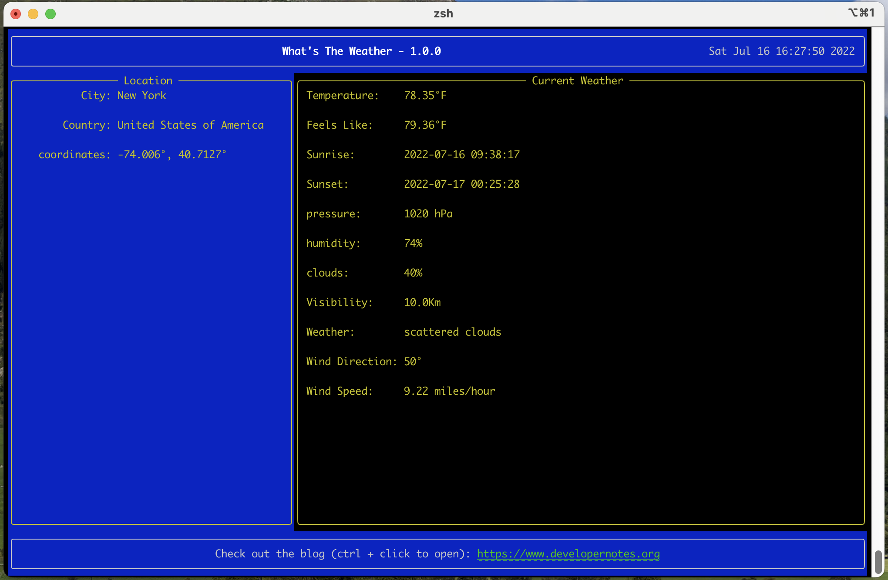
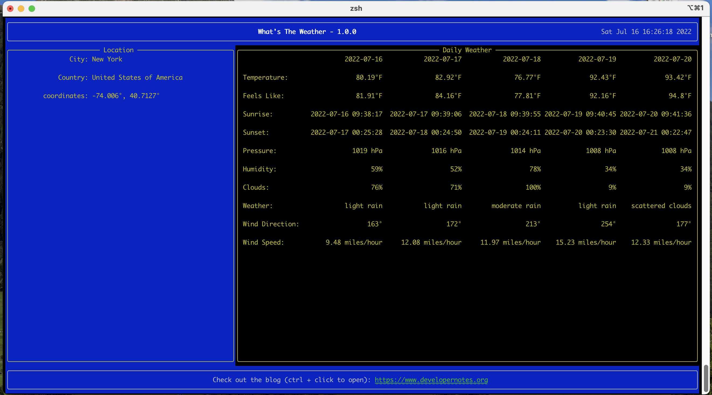

# What's The Weather


This is a command line application that queries the OpenWeatherMap API and displays the weather forecast in tabular 
format.  There are two reports - the current weather report and the daily weather report.



The Current Weather Report.



The Daily Weather Report.

## Libraries

The application uses the following libraries to build the command line interface and display the weather reports.

| Library  | Description                                |
|----------|--------------------------------------------|
| click    | Handles the command line parsing           |
| inquirer | Collects user input                        |
| rich     | Handles the display of the weather reports |

## Usage

Start by creating a virtual environment using an environment manager such as PIPENV to do so:

```
pipenv --python 3.10.5
```

Activate the environment and install the application:

```
pipenv shell
pipenv install 
```

## Follow Up

A detailed commentary of this application can be found here: [Developer Notes](https://www.developernotes.org)
