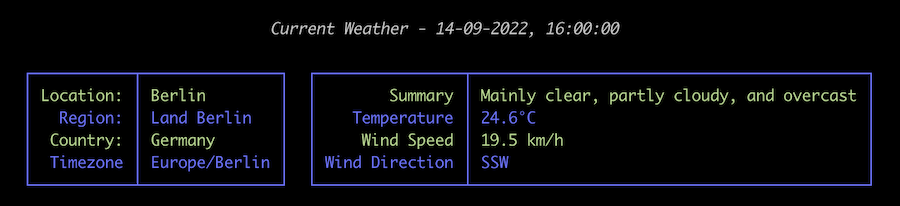

# What's The Weather


This is a command line application that displays the current weather and forecast in tabular 
format for the given location.

## Installation

The application can be installed into the default python installation on yor desktop computer or into a newly created 
virtual environment.  To create a new environment and activate it using [Pipenv](https://pipenv.pypa.io/en/latest/) 
execute the following commands:

```
pipenv --python 3.10.5
pipenv shell
```

After this you are ready to install the application using the following command:

```
pipenv install git+https://github.com/dooley-ch/whatstheweather#egg=whatstheweather
```

Once the application has been installed, you can check the version number to ensure that it has been properly installed:

```
whatstheweather --version
```

## Usage

Before you can request the current weather or forecast, you need to add a location.  To do this execute the following 
command and follow the on-screen instructions.

```
whatstheweather location add
```


To list the available locations, execute the following command:

```
whatstheweather location list
```


To obtain the current weather for Rome, issue the following command:

```
whatstheweather weather current Rome
```



To obtain the weather forecast for Rome, issue the following command:

```
whatstheweather weather forecast Rome
```


## Libraries

The application uses the following libraries to build the command line interface and display the weather reports.

| Library  | Description                                |
|----------|--------------------------------------------|
| click    | Handles the command line parsing           |
| rich     | Handles the display of the weather reports |

## Follow Up

A detailed commentary of this application can be found here: [Developer Notes](https://www.developernotes.org/2022/08/command-line-reference-application/)
 